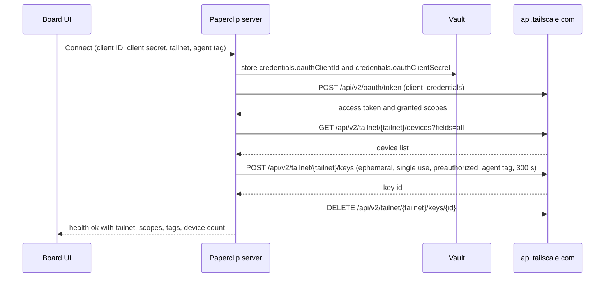

# Tailscale

This connection holds a Tailscale OAuth client for one tailnet. Paperclip uses
it server-side to list tailnet devices and to mint short-lived, single-use,
tagged auth keys. Later features build on it: tailnet machines as `ssh`
environments and sandboxes that join the tailnet for one run. In this version
agents get no tool from the connection. They get network reach, not control of
the tailnet.

Neither Paperclip ID nor Paperclip Connect participates. Cloud and self-hosted
instances use the same server-side path. The instance needs outbound HTTPS to
`api.tailscale.com`.

## Connect and configure

Choose **Tailscale** (`tailscale`) in Apps and paste the client ID and client
secret of an OAuth client. Both values go into the Paperclip vault as company
secrets. The grant is organization-wide. The OAuth client, the API tokens
minted from it, and any auth key never reach an agent runtime, the board UI,
a log line, or the credential export path.

Fields:

| Field | Default | Meaning |
| --- | --- | --- |
| OAuth client ID, OAuth client secret | required | Created once in the Tailscale admin console. The secret is shown only at creation. |
| Tailnet | `-` | `-` means the tailnet that owns the OAuth client. Enter the tailnet name, such as `example.com` or `tail1234.ts.net`, only when the client belongs to a different tailnet. |
| Agent tag (Advanced) | `tag:paperclip-agent` | The tag that machines and sandboxes carry when they join the tailnet for agents. The OAuth client must be allowed to assign it. |

## Administrator setup

1. Add the tags and grants below to the tailnet policy file in
   [Access controls](https://login.tailscale.com/admin/acls/file). Adjust the
   `tag:dev-box` and `tag:internal-api` examples to the machines and services
   agents should reach.

   ```json
   {
     "tagOwners": {
       "tag:paperclip-control": ["autogroup:admin"],
       "tag:paperclip-agent": ["autogroup:admin", "tag:paperclip-control"],
       "tag:dev-box": ["autogroup:admin"]
     },
     "grants": [
       { "src": ["tag:paperclip-control"], "dst": ["tag:dev-box"], "ip": ["tcp:22"] },
       { "src": ["tag:paperclip-agent"], "dst": ["tag:internal-api"], "ip": ["tcp:443"] }
     ],
     "ssh": [
       { "action": "accept", "src": ["tag:paperclip-control"], "dst": ["tag:dev-box"], "users": ["agent"] }
     ]
   }
   ```

2. Create one OAuth client in
   [Trust credentials](https://login.tailscale.com/admin/settings/oauth) with
   the scope `auth_keys` (tags `tag:paperclip-agent` and
   `tag:paperclip-control`) and the scope `devices:core`. Copy the client ID and
   the secret.
3. Paste both into Apps > Tailscale > Connect and finish setup. The connection
   check below runs during setup and again on every health check.
4. Enable network flow logs in the Tailscale admin console if the tailnet policy
   requires an audit trail of agent traffic.

Scopes and tags are fixed when the OAuth client is created. Paperclip cannot
widen an existing client. When the check reports a missing scope or a tag the
client cannot assign, create a new client and reconnect.

## Connection check



The check proves three things in order: the client is valid, it can read
devices (`devices:core`), and it can mint keys with the agent tag (`auth_keys`
plus tag ownership). The test key is reusable `false`, ephemeral `true`,
preauthorized `true`, expiry 300 seconds, and it is deleted immediately. It is
deleted even when a later validation step fails. A failed deletion is reported
with its own code; the key still expires on its own within five minutes.

The redacted result is stored on the connection as `config.tailscale`
(`tailnet`, `scopes`, `tags`, `deviceCount`, `checkedAt`) and shown as the
health message, for example:

```text
Tailscale OAuth client is connected to the client's tailnet. Scopes: auth_keys, devices:core. Tags: tag:paperclip-agent. Devices visible: 12.
```

Failures map to fixed codes. The message names the scope, tag, or tailnet to
fix. Provider response bodies are discarded unread, because they can name
tailnets, tags, and key identifiers.

| Code | HTTP | Cause and fix |
| --- | --- | --- |
| `tailscale_client_invalid` | 422 | The token endpoint rejected the client ID or secret. Create a new OAuth client and reconnect. |
| `tailscale_scope_devices_missing` | 422 | The token lacks `devices:core`, or the device list returned 403. Create a client with that scope. |
| `tailscale_scope_auth_keys_missing` | 422 | The token lacks `auth_keys`, or key creation was refused for a client without it. |
| `tailscale_tag_not_owned` | 422 | Key creation was refused or the issued key does not carry the agent tag. Add the tag to the client's `auth_keys` scope and to `tagOwners`. |
| `tailscale_tailnet_not_found` | 422 | The tailnet name is wrong for this client. Use `-` or the exact name. |
| `tailscale_rate_limited` | 502 | Tailscale returned 429. Retry in a minute. |
| `tailscale_unreachable` | 502 | The instance could not reach `api.tailscale.com`. |
| `tailscale_test_key_cleanup_failed` | 502 | The test key was minted but not deleted. It expires within five minutes. |
| `tailscale_request_failed` | 502 | Another provider status or an unexpected response shape. |

## Boundaries

- The catalog entry is `transport: rest_api` and `auth: api_key`, matched by
  `config.sourceTemplateKey === "tailscale"`. It never enters the MCP gateway
  and discovery returns no tools.
- `keyPlacement` is a body placement, not a header. The client is sent only in
  the body of the token request, so setup writes vault secret refs and no header
  projection.
- The credential export path and the agent token mint refuse this connection.
- Provider error bodies are never read. Response bodies are bounded to 16 MiB.
- Deleting devices is implemented in the API client for later lifecycle work and
  is not used by the connection check.

## Validation and live proof

Deterministic tests:

- `server/src/__tests__/tailscale-api.test.ts`: the REST boundary against a
  fake Tailscale API. Token exchange shape, device listing, key mint and delete,
  every failure code, cached tokens, deletion of the test key after a later
  failure, and redaction of the client secret, token, key secret, and provider
  body.
- `server/src/__tests__/tailscale-connection.test.ts`: the connection lifecycle
  through the real vault and setup path on embedded Postgres. Setup runs the
  check, stores the redacted summary, keeps secrets out of config and health
  fields, maps a provider refusal to an actionable 422, and refuses credential
  export.
- `packages/shared/src/app-definitions.test.ts`: catalog shape, fields,
  defaults, placement, and URL match.

Live proof is not run yet. The connection was built from the official
[OAuth client documentation](https://tailscale.com/kb/1215/oauth-clients) and
the official Go client (`tailscale-client-go-v2`). To record it:

1. Create the OAuth client described above in a test tailnet.
2. Paste it into Apps > Tailscale > Connect and finish setup.
3. Copy the health message and the `tool_connection.health_check` audit row
   into this section, with the tailnet name and device count redacted.
4. Confirm in the Tailscale admin console under Settings > Keys that no
   `Paperclip connection check` key remains.

Record the result as a dated **Verification record** section here and set
`liveProof` for `tailscale/oauth-client` in
`doc/connections/tool-method-permission-reviews.json`.

## Provider research

Reviewed on 2026-10-09:

- [OAuth clients](https://tailscale.com/kb/1215/oauth-clients): client
  credentials grant at `POST https://api.tailscale.com/api/v2/oauth/token`,
  scopes fixed at creation, tags attached to `auth_keys`.
- [Tailscale API](https://tailscale.com/api): device list with `fields=all`,
  key creation body (`capabilities.devices.create` with `reusable`,
  `ephemeral`, `preauthorized`, `tags`, plus `expirySeconds` and
  `description`), key deletion, device deletion. The key secret is returned
  only by the create response.
- [Go client](https://github.com/tailscale/tailscale-client-go-v2): confirms
  the request and response shapes above and that `-` names the tailnet that
  owns the client.
- Official artwork: the mark from `https://tailscale.com/favicon.svg`,
  re-authored as a sanitized local SVG with a dark variant; provenance is in
  the app brand manifest.
